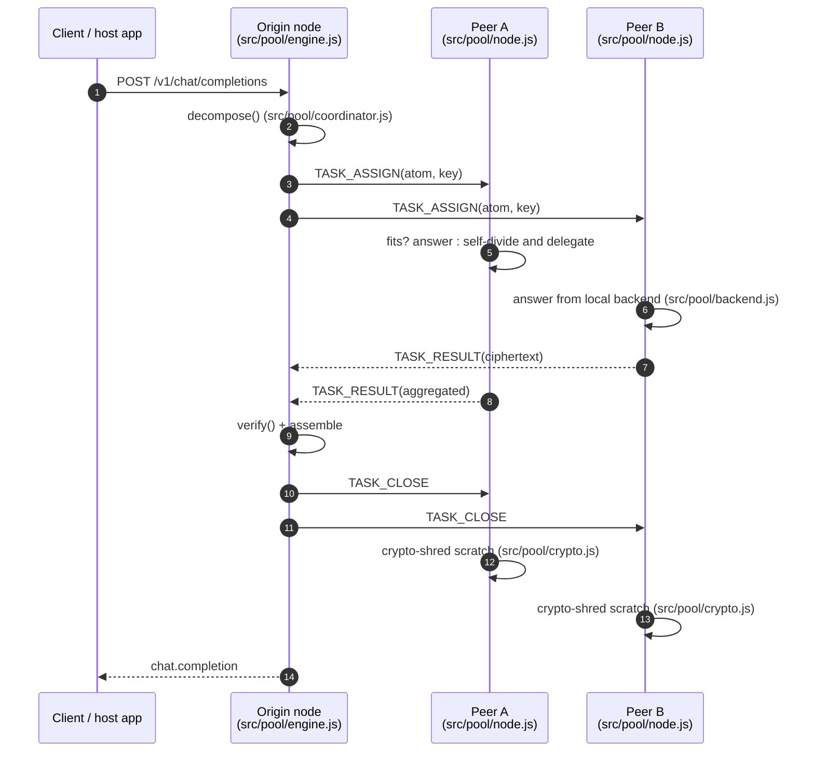
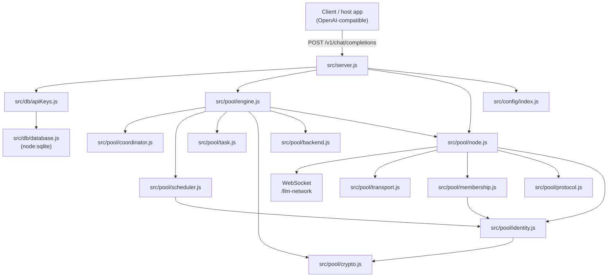

# Arrow Compute Node

A standalone **peer-to-peer compute-sharing node for inference**. Peers contribute
idle compute; an inference request is **decomposed** into atomic directives,
**assigned** to nearby peers, **self-divided** and delegated when a peer cannot
fit its part, **retrieved** up the delegation tree, **verified**, and
**assembled**. Task data is transient and **crypto-shredded**.

It runs as a single process launched with `npm start`, serving an
**OpenAI-compatible inference endpoint** while also acting as a **compute peer**.
It connects to a host app (e.g. LoOper) **only as an inference source**. Storage
is **SQLite** (a local file) — there is no MongoDB.

## Requirements

- **Node.js 22.5+** with the built-in `node:sqlite` module (tested on Node 25;
  on Node 22.5–23 `node:sqlite` needs `--experimental-sqlite`).
- Dependencies: `express`, `ws`, `cors`, `dotenv`, `uuid`, `winston`,
  `winston-daily-rotate-file`, `chalk`.

## Quick start

```bash
npm install
cp .env.example .env

# create an API key for the inference endpoint (stored in SQLite)
node -e "require('./src/db/database').openDatabase('arrow.db'); require('./src/db/apiKeys').ensureApiKey('dev-key','dev')"

npm start
```

The node listens on `:3000` by default. Call it like any OpenAI chat endpoint:

```bash
curl -X POST http://localhost:3000/v1/chat/completions \
  -H "Content-Type: application/json" \
  -H "x-api-key: dev-key" \
  -d '{"messages":[{"role":"user","content":"do alpha and beta and gamma"}]}'
```

Join more peers by pointing new nodes at a running one:

```bash
ARROW_BOOTSTRAP=10.0.0.5:3000 PORT=3001 npm start
```

## HTTP API

| Method | Path | Auth | Description |
|---|---|---|---|
| `POST` | `/v1/chat/completions` | `x-api-key` (or `Authorization: Bearer`) | Run one inference request through the pool; returns an OpenAI-style `chat.completion`. |
| `GET` | `/health` | none | Node status: `{ status, peer, peers, uptime }`. |

The pool itself communicates over the WebSocket path `/llm-network` on the same
port.

## How a request flows

1. **Origin** (`engine.complete`) decomposes the prompt and picks peers
   (`coordinator` + `scheduler`).
2. It sends `TASK_ASSIGN` (the atom + the per-task key) to each chosen peer.
3. A **peer** answers the atom from its **local backend** — or, if the atom is
   too big for its budget, **self-divides**: keeps one manageable piece and
   delegates the rest to other peers (recursively).
4. Peers return `TASK_RESULT` **up the delegation tree** to their parent.
5. The origin **verifies** each returned chunk and **assembles** the accepted
   ones into one response.
6. `TASK_CLOSE` propagates down the tree; every node **shreds its per-task key**
   and clears its scratch (crypto-shred).



## Architecture



## Module reference

| File | Responsibility |
|---|---|
| [src/server.js](src/server.js) | Express + WebSocket server; endpoints; wires the node and engine. |
| [src/config/index.js](src/config/index.js) | Environment-driven configuration. |
| [src/db/database.js](src/db/database.js) | SQLite (`node:sqlite`) open + schema (`api_keys`, `peers`). |
| [src/db/apiKeys.js](src/db/apiKeys.js) | API-key lookup for the inference endpoint. |
| [src/pool/protocol.js](src/pool/protocol.js) | Message types + newline-JSON framing. |
| [src/pool/crypto.js](src/pool/crypto.js) | Ed25519 identity keys; per-task AES-256-GCM; `shred()`. |
| [src/pool/identity.js](src/pool/identity.js) | `PeerIdentity` + signed `PeerRecord`. |
| [src/pool/membership.js](src/pool/membership.js) | Signed peer table; last-write-wins merge; gossip batches. |
| [src/pool/scheduler.js](src/pool/scheduler.js) | Proximity × idle-compute peer scoring and assignment. |
| [src/pool/coordinator.js](src/pool/coordinator.js) | `decompose` / `pick` / `verify` / `manageable` decisions. |
| [src/pool/task.js](src/pool/task.js) | Task sessions, delegation tree, and the erase step. |
| [src/pool/transport.js](src/pool/transport.js) | WebSocket `PoolLink` (framing + RTT). |
| [src/pool/node.js](src/pool/node.js) | `PoolNode`: handshake, heartbeat, gossip, message dispatch. |
| [src/pool/engine.js](src/pool/engine.js) | The protocol: divide, delegate, retrieve, verify, assemble. |
| [src/pool/backend.js](src/pool/backend.js) | Local inference backend (`EchoBackend`, `OpenAIBackend`). |
| [src/middleware/requestLogger.js](src/middleware/requestLogger.js) | HTTP request/response logging. |
| [src/utils/logger.js](src/utils/logger.js) | Winston logger. |

## Configuration (`.env`)

| Variable | Default | Meaning |
|---|---|---|
| `PORT` | `3000` | HTTP + WebSocket port. |
| `HOST` | `0.0.0.0` | Bind address. |
| `ARROW_DB` | `arrow.db` | SQLite database file. |
| `ARROW_CORES` | `4` | Idle cores contributed to the pool. |
| `ARROW_RAM_MB` | `2048` | Idle RAM (MB) contributed. |
| `ARROW_GPU` | `0` | Advertise a GPU (`1`/`true`). |
| `ARROW_MODELS` | (empty) | Comma-separated model names advertised. |
| `ARROW_BOOTSTRAP` | (empty) | Peers to join at startup, `host:port,host:port`. |
| `ARROW_BACKEND_URL` | (empty) | Local OpenAI-compatible model server that answers atoms. |
| `ARROW_BACKEND_MODEL` | `default` | Model name for the backend server. |
| `ARROW_BACKEND_KEY` | (empty) | API key for the backend server. |
| `ARROW_RESULT_TIMEOUT_MS` | `15000` | How long the origin waits for a task. |

## Tests

```bash
npm test        # node --test
```

Covers identity signing, membership (LWW/forgery rejection), the scheduler, the
crypto-shred, and an end-to-end test: a request is divided across three nodes,
assembled on the origin, and every worker's scratch is erased.

## Security

- **Identity** — Ed25519 signed handshake; membership records are signed, so
  gossip cannot be forged.
- **Secrecy** — per-task AES-256-GCM with a destructible key (crypto-shred);
  knowledge stays local and only derived results move.
- **Integrity** — every returned chunk is verified before it is included.
- **Storage** — SQLite with `PRAGMA secure_delete=ON`.

## Not included

This node is deliberately narrow. It has **no UI**, **no email/Postmark**, **no
token economy**, **no user signup**, **no admin/debug console**, and **no
MongoDB**. It is not a workflow/chain interpreter, and it has no NAT traversal or
relay — peers are reached by outbound WebSocket dial (`ARROW_BOOTSTRAP`).

## Repository layout

```
src/
  server.js
  config/index.js
  db/database.js
  db/apiKeys.js
  middleware/requestLogger.js
  pool/…            (protocol, crypto, identity, membership, scheduler,
                     coordinator, task, transport, node, engine, backend)
  utils/logger.js
package.json
.env.example
```
