# LoOper — User & Agent Reference

**Looper** is a desktop-native automation platform that records mouse/keyboard actions into reusable **Sequences**, combines them with AI-powered logic nodes into directed **Chain** graphs, executes them through a **Workflow Interpreter** (dependency-gated scheduling, branching, loops, nested chains), and turns chains into agents: a **System chain** is the agent's mind, and an **Orchestrator** root routes a goal across mini brains until it is achieved — locally, with bundled models (llama.cpp / Ollama, Laya decision engine, vision, OCR, speech), no cloud.

This document is the single reference for both human users and AI agents: architecture, every node type, the execution engine, agent mode (goal loop, worker naming, propagation, learned chains, diagnostics), scheduling, sandboxing, dialogs, file formats and troubleshooting. All flows are diagrams (Mermaid); all tables are configuration truth taken from the source.

---

## Table of Contents

1. [Architecture Overview](#1-architecture-overview)
2. [Recording Sequences](#2-recording-sequences)
3. [Chain JSON Schema](#3-chain-json-schema)
4. [Node Types Reference](#4-node-types-reference)
5. [Workflow Execution Engine](#5-workflow-execution-engine)
6. [Data Flow Between Nodes](#6-data-flow-between-nodes)
7. [Conditional Logic](#7-conditional-logic)
8. [LLM Integration](#8-llm-integration)
9. [Context System](#9-context-system)
10. [Agent Mode](#10-agent-mode)
11. [Scheduling](#11-scheduling)
12. [Sandboxing](#12-sandboxing)
13. [Practical Workflow Patterns](#13-practical-workflow-patterns)
14. [Node Dialogs Reference](#14-node-dialogs-reference)
15. [Keyboard Shortcuts](#15-keyboard-shortcuts)
16. [Troubleshooting](#16-troubleshooting)
- [Appendix A — File Formats](#appendix-a--file-formats)
- [Appendix B — Environment Switches](#appendix-b--environment-switches)
- [Appendix C — Testing & Evaluation](#appendix-c--testing--evaluation)

---

## 1. Architecture Overview

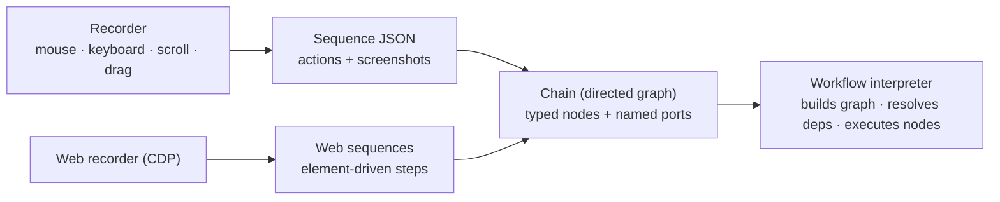

### Runtime topology

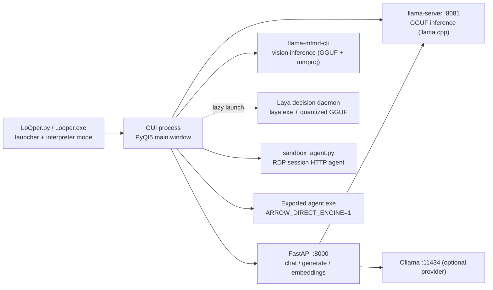

- **Launcher** — can run the GUI or execute a script directly (how the RDP sandbox agent and exported agents are spawned).
- **GUI** — graph editor, overlays, scheduler thread, recorder listeners, and (by default) the FastAPI server.
- **Engines on demand** — nothing is preloaded at startup; llama.cpp models load per burst and release after inactivity; the Laya daemon loads (~2 s) and unloads per decision burst. No timeouts on local inference — interruption is the stop flag's job.
- **Exported agents** — a system chain + its transitive chains compiled into a standalone exe (see the README's export section); fully offline.

### Key components

| Component | Role |
|-----------|------|
| **Recorder** (`recorder/`) | Captures clicks, typing, scrolls, drags with cropped screenshots + UIA elements |
| **Web recorder/replay** (`player/web/`) | CDP-based DOM recording and element-driven replay (never absolute coordinates) |
| **Sequence Player** (`player/sequence_player.py`) | Replays one sequence via UIA-first + template-matching cascade |
| **Multi-Sequence Player** (`player/multi_sequence_player.py`) | Loads a chain, builds the graph, delegates to the WorkflowExecutor |
| **WorkflowGraphBuilder** (`player/multi_sequence/worflow_interpreter_modules/builder.py`) | Chain JSON → unified graph (`{node_id: {type, data, connections, inputs}}`), tool-provider gating |
| **WorkflowExecutor** (`…/executor_modules/core.py`) | Scheduler loop; 14 mixins (dependencies + 13 per-type op modules: sequence, conditional, llm, chain, code, container, context, input, handle, form filler, MCP, output, orchestrator) |
| **LLMExecutor** (`player/multi_sequence/llm_executor_resources/executor.py`) | Prompt assembly, variable substitution, provider routing, tool selection, skill routing, vision |
| **SimpleChainRouter** (`player/agentic_ops/simple_agent.py`) | Agent mode dispatch: every query runs through the selected System chain; memory-only chat answers from the activity timeline |
| **Orchestrator executor** (`…/executor_modules/orchestrator_ops.py`) | The agent goal loop: planning, worker picking, scoping, verification, handback + freeze, propagation packet, routing shadows |
| **Laya client** (`AI/laya_client.py`) | Embedded System-1 decision engine (typed `noul`/`choice`): picker, gates, verifiers — optional, LLM fallback everywhere |
| **Action graph** (`…/executor_modules/action_graph.py`) | Derived per-chain action entities + executor-thread edges; powers the routing shadow logs |
| **Run memory** (`player/agentic_ops/run_memory.py`) | Append-only SQLite activity timeline: every run, node, chat turn, schedule event |
| **ContextDatabase** (`AI/context_database.py`) | SQLite-backed append-only store for Context nodes |
| **ComoRAG / Graph RAG** (`AI/comorag_engine.py`, `AI/graph_rag.py`) | Probe-driven retrieval and temporal reasoning over stored context |
| **ActionHandlers** (`player/action_handlers.py`) | Physical actions: click cascade, typing, keystrokes, scroll, clipboard, drag |

### Project structure

| Folder | Purpose |
|--------|---------|
| `sequences/` | Recorded desktop sequences + `screenshots/` |
| `web_sequences/` | Recorded browser sessions (element-driven) |
| `chains/` | Chain workflows (incl. System chains, mini brains, `learned/` artifacts) |
| `AI/` | FastAPI server, engines, embeddings, RAG, Laya engine, models, `bin/` |
| `NGUI/` | PyQt5 editor, node resources, dialogs, overlays, scheduler |
| `player/` | Execution: sequence player, multi-sequence player, action handlers |
| `player/agentic_ops/` | Agent runtime: system-chain router, chain executor, run memory, goal ledger, description repair |
| `recorder/` | Desktop capture, sequence manager |
| `runtime/code_nodes/`, `runtime/venvs/` | Auto-generated code modules and per-chain venvs |
| `data/` | `context.db`, `run_memory.db`, `agent_goals.json`, voices, models |
| `docs/` | This guide and `EVALUATION_PLAN.md` (the technical README is `LoOper/README.MD`) |

---

## 2. Recording Sequences

Recording captures your actions into a reusable sequence file.

1. Click **Record** in the toolbar (or the menu).
2. Perform actions on screen — clicks, typing, scrolling, drags.
3. Press **ESC** or click **Stop** to end.
4. The sequence is saved to `sequences/` automatically.

### Action types

| Action Type | JSON Fields | Description |
|-------------|-------------|-------------|
| `click` | `button`, `coordinates{x,y}`, `screenshot` (path/base64), `app_context`, `offset_x`, `offset_y` | Click with template-matching screenshot |
| `type_string` | `text`, `batch_size`, `batch_delay` | Typed text (batched; clipboard paste for Unicode) |
| `keystroke` | `key`, `modifiers[]` | Special key press (Enter, Tab, F1–F12, …) |
| `clipboard` | `operation` (c/v/x/a/z/y) | Ctrl+C / V / X / A / Z / Y |
| `scroll` | `clicks`, `coordinates{x,y}` | Scroll bursts grouped into one action |
| `drag_drop` | `from{x,y}`, `to{x,y}` | Mouse drag |
| `move_to` | `coordinates{x,y}` | Mouse movement (recorded while holding Right-Ctrl) |
| `absolute_click` | `coordinates{x,y}` | Click at exact coordinates, ignoring offsets (hold Right-Shift) |
| `ctrl_click` | `coordinates{x,y}` | Ctrl+Left click |
| `shift_click` | `coordinates{x,y}` | Shift+Left click |

### Special recording actions

| Action | Recording method | Result |
|--------|------------------|--------|
| **Ctrl+Click** | Hold Ctrl + Left click | `ctrl_click` |
| **Shift+Click** | Hold Shift + Left click | `shift_click` |
| **Absolute click** | Hold Right-Shift + Left click | `absolute_click` (no offsets) |
| **Cursor move only** | Hold Right-Ctrl and move | `move_to` |
| **Drag** | Press, drag, release | `drag_drop` with `from`/`to` |
| **Clipboard shortcuts** | Ctrl+C / V / X / A / Z / Y | `clipboard` with operation `c/v/x/a/z/y` |

### Screenshot capture & deduplication

Small screenshots (70×70 px default) are captured around each click; stored in `sequences/screenshots/`, embedded as base64 for portability, and deduplicated by MD5 — identical images share one file referenced by `screenshot_hash`. Playback uses them for template matching.

### App context

Every action records the active window (`exe`, `process_name`, `title`, `pid`). During playback the player focuses the recorded app first when `use_app_opened` is set.

### Smart features

- **Scroll burst grouping** — rapid scrolls collapse into one `scroll` action.
- **Text buffering** — typed characters batch into one `type_string`.
- **Modifier recognition** — Ctrl shortcuts become clipboard operations.
- **UIA element capture** — the Windows element under each click (ControlType + bounds) is stored alongside the screenshot; replay resolves the LIVE element first (survives moved windows, DPI/theme changes) and only falls back to template matching.

---

## 3. Chain JSON Schema

A chain is a JSON document whose top-level sections each hold a list of typed nodes (the graph is stored as node lists + connections, never as an opaque blob).

### Top-level structure

```json
{
  "name": "My Chain",
  "description": "What this chain does — used at runtime for tool/worker descriptions",
  "collection": "Tools",
  "is_default": false,

  "sequences": [...],
  "web_sequences": [...],
  "conditional_nodes": [...],
  "llm_nodes": [...],
  "chain_import_nodes": [...],
  "form_filler_nodes": [...],
  "code_nodes": [...],
  "container_nodes": [],
  "context_nodes": [...],
  "input_nodes": [...],
  "handle_nodes": [...],
  "mcp_nodes": [...],
  "output_nodes": [...],
  "orchestrator_nodes": [...],
  "tts_nodes": []
}
```

| Section | Node type | Purpose |
|---------|-----------|---------|
| `sequences` | Sequence | Replay a recorded desktop sequence |
| `web_sequences` | Web Sequence | Replay a recorded browser session |
| `conditional_nodes` | Conditional | Branch on image / OCR / code / LLM / layout conditions (`true`/`false` ports) |
| `llm_nodes` | LLM | Local inference: reasoning, tools, vision, skills, TTS redirection |
| `chain_import_nodes` | Chain Import | Run another chain as a sub-workflow / tool / brain |
| `form_filler_nodes` | Form Filler | Document-grounded multi-field form completion |
| `code_nodes` | Code | Custom Python with JSON in/out |
| `container_nodes` | Container | VM-based grouping node (subgraph mode deprecated) |
| `context_nodes` | Context | Persistent cross-chain memory |
| `input_nodes` | Input | Value injection, questions, decision routing, media acceptance |
| `handle_nodes` | Handle | Vision-based click/scroll/zoom grounding (desktop or web mode) |
| `mcp_nodes` | MCP | Model Context Protocol server tools |
| `output_nodes` | Output | Expose results to the overlay / outside the chain |
| `orchestrator_nodes` | Orchestrator | Goal loop over mini-brain chains (agent mode root) |
| `tts_nodes` | (legacy) | Auto-migrated into LLM nodes with TTS enabled |

Chain metadata: `name`, `description` (the routing text for tools and workers — keep it accurate; it is read at runtime), `collection` (e.g. `System`, `Tools`), `is_default` (marks the root System chain the agent dispatches to by default).

### Node common fields

| Field | Type | Description |
|-------|------|-------------|
| `node_id` | string | Unique identifier (e.g. `"0x27918162a90"`) |
| `position` | [x, y] | Canvas position (editor only, not execution) |
| `connections` | array | Output connections: `{output_port, target_node_id, input_port}` |
| `label` / `description` | string | Human text; for routable nodes (code, sequence, web sequence, conditional, orchestrator, tool imports) the description is the routing signal |

### Minimal chain example

```json
{
  "name": "Open an app and log in",
  "sequences": [
    {
      "node_id": "SEQ1",
      "sequence_file": "open_app.json",
      "loop_count": 1,
      "connections": [{"output_port": "output", "target_node_id": "LLM1", "input_port": "input"}]
    }
  ],
  "llm_nodes": [
    {
      "node_id": "LLM1",
      "model": "llama3.2",
      "prompt": "Did the login succeed? Reply YES or NO.",
      "input_source": "previous",
      "output_variable": "login_verdict",
      "connections": [{"output_port": "output", "target_node_id": "OUT1", "input_port": "input"}]
    }
  ],
  "output_nodes": [
    {"node_id": "OUT1", "label": "Result"}
  ]
}
```

---

## 4. Node Types Reference

### 4.1 Sequence Node

**Purpose**: Replays a recorded desktop sequence file action-by-action (UIA element first, template matching fallback, recorded coordinates last).

| Property | Type | Default | Description |
|----------|------|---------|-------------|
| `sequence_file` | string | — | Path to the sequence JSON (relative to chains dir or absolute) |
| `loop_count` | int | 1 | Repetitions |
| `extra_delay` | float | 0 | Seconds between iterations |
| `use_app_opened` | bool | false | Focus the recorded app before playing |
| `description` | string | — | Routing text (agent mode / tool selection) |
| `actions` | array | [] | Inline actions (if empty, loaded from file) |

**Ports**: 1 input (`input`), 1 output (`output`)

**Execution**: loads the sequence, iterates `loop_count` times, replays each action; sandbox overrides propagate.

### 4.2 Web Sequence Node

**Purpose**: Replays a recorded browser session — element-driven steps (selectors + text identity), never absolute coordinates.

| Property | Type | Default | Description |
|----------|------|---------|-------------|
| `session_file` / `name` | string | — | Web sequence file in `web_sequences/` (bare names resolve against that folder; the file carries `mode: web`) |
| `headless` | bool | false | Visible browser by default; headless is opt-in |
| `speed` | float | 1.0 | Playback pacing multiplier |
| `native_actions` | bool | true | Trusted CDP input first; in-page JS dispatch as fallback |
| `loop_count` / `extra_delay` / `repeat_mode` | int/float/string | 1 / 0 / count | Repetition controls |
| `extract_items` | array | [] | Entity extraction targets for repeating elements |

**Ports**: 1 input (`input`), 1 output (`output`). One shared durable Chrome profile is used app-wide (cookies/logins persist; pages are never restored).

### 4.3 Conditional Node

**Purpose**: Evaluates a condition and branches to `true` or `false`.

| Property | Type | Default | Description |
|----------|------|---------|-------------|
| `condition_type` | string | `"presence"` | `presence`, `absence`, `ocr`, `code`, `llm`, `layout_match`, `loop` |
| `image_path` / `image_data` | string | — | Trigger screenshot (path or base64) |
| `threshold` | float | 0.8 | Match confidence (0.0–1.0) |
| `wait_time` / `timeout` | float | 10 / 5.0 | Wait timeout; code execution timeout |
| `ocr_text` | string | — | Target text for OCR triggers |
| `case_sensitive`, `language` | bool, string | true, `"eng"` | OCR matching options |
| `code` | string | — | Python for code conditionals |
| `llm_prompt`, `llm_engine`, `llm_model`, `llm_use_vision` | — | `"ollama"` | LLM conditional configuration |
| `loop_type` | string | — | `while_present`, `while_absent`, `until_present`, `until_absent` |
| `loop_position` | string | `"pre"` | Run loop before (`pre`) or after (`post`) the node |
| `sequence_file`, `iteration_delay`, `max_loops` | — | 0.05, 10 | Loop body + pacing + cap |
| `loop_condition` | string (JSON) | — | Loop condition payload |

**Ports**: 1 input (`input`), 2 outputs (`true`, `false`)

**Condition types**:

| Type | True when | False when |
|------|-----------|------------|
| `presence` | Template matches above threshold within timeout | Timeout without match |
| `absence` | Image stays absent for the full timeout | Image appears before timeout |
| `ocr` | OCR finds `ocr_text` with sufficient confidence | Text not found |
| `code` | Code sets `result = True` (or a `condition()`/`check()`/`eval*()` function returns truthy) | Code sets False or errors |
| `llm` | Model answers "true" | "false" / unparseable (last standalone true/false wins, `<think>` tags stripped) |
| `layout_match` | Region matches template at the captured position within tolerance | No match after `max_attempts` scrolls |

**Creating image triggers**: use **Capture…** in the dialog — the window minimizes, the screen freezes, draw the target rectangle, and the screenshot + path are stored. **Layout Match** additionally stores the captured `target_x/target_y/target_w/target_h` and a `position_tolerance` for position-aware matching.

**Execution**: `_evaluate_conditional()` dispatches per type; the unchosen branch's nodes are marked `skipped` (BFS from the unchosen port, minus nodes also reachable from the chosen port, so merges never stall).

### 4.4 LLM Node

**Purpose**: Local AI inference via Ollama or llama.cpp — text generation, data processing, tool selection, skills, vision.

| Property | Type | Default | Description |
|----------|------|---------|-------------|
| `model` | string | `"llama3.2"` | Ollama model name, or GGUF path with `use_llamacpp` |
| `prompt` | string | — | User prompt with `{variable}` substitution |
| `system_message` | string | — | System instructions |
| `temperature` / `max_tokens` | float / int | 0.7 / 4096 | Sampling controls |
| `output_variable` | string | `"llm_output"` | Variable name for the response |
| `input_source` | string | `"none"` | `none`, `ocr`, `page_text`, `previous`, `clipboard`, `input`, `context` |
| `write_text` | bool | true | Auto-type the generated text |
| `use_vision`, `vision_model`, `screenshot_enabled` | bool/string/bool | false | Screenshot-based inference for VL models |
| `use_llamacpp`, `llamacpp_model_path`, `llamacpp_gpu_layers`, `llamacpp_threads`, `llamacpp_context_size` | — | | llama.cpp backend configuration |
| `use_async` | bool | true | Non-blocking execution |
| `use_direct_rag`, `rag_*` | — | | Direct retrieval against context/document sources |
| `use_skill_routing`, `skills`, `semantic_description` | — | true, [] | Skill system (see §8) |
| `tool_descriptions` | dict | runtime-derived | Tool routing text — populated from the connected tool chains at runtime, never persisted stale |
| `use_context_consolidation`, `consolidation_*` | — | false | Probe-driven memory organization loop |

**Ports**: 3 inputs (`input`, `tools`, `context`), 2 outputs (`output`, `context`)

**Execution**: see §8 for input sources, prompt assembly, tool selection, skills, vision, consolidation, TTS redirection.

### 4.5 TTS Node (legacy)

**Purpose**: Text-to-speech output.

| Property | Type | Default | Description |
|----------|------|---------|-------------|
| `text` | string | — | Text to speak (`{variable}` substitution supported) |
| `language` | string | `"en"` | BCP-47 language code |

**Ports**: 1 input, 1 output. When an LLM output connects to a TTS node the LLM disables `write_text` and the TTS node speaks the LLM's output variable. Legacy standalone TTS nodes are auto-migrated into LLM nodes with TTS enabled.

### 4.6 Chain Import Node

**Purpose**: Embeds and executes another chain as a sub-workflow, a tool, or a mini brain.

| Property | Type | Default | Description |
|----------|------|---------|-------------|
| `chain_file` / `chain_file_path` | string | — | Path to the chain JSON |
| `import_mode` | string | `"full"` | `full`, `sequences_only`, `nodes_only` |
| `prefix` | string | — | Alias for imported nodes (also the tool alias the router sees) |
| `loop_count` / `extra_delay` | int / float | 1 / 0 | Repetition controls |
| `run_in_sandbox` / `show_sandbox_window` | bool / bool | false / true | Isolated RDP execution |

**Ports**: 1 input, 1 output. **Router ports decide its role**: wired to an LLM's `tools` port or an Orchestrator's `brains`/`chains` port it is gated as a **tool provider** — it never runs standalone; the router invokes it. A chain that contains an orchestrator belongs on `brains`; an orchestrator-free composition belongs on `chains` (routing inference vs mechanical worker).

**Execution**: creates a sub-player for the imported chain, copies the scoping pair + propagation packet variables (`_chain_goal`, `_chain_step`, `_chain_root_goal`, `_chain_plan`, `_chain_state`) and `_chain_input_context` into it, propagates sandbox context, and records results under `node_{id}_last_chain_result` / `chain_tool_results`.

### 4.7 Code Node

**Purpose**: Custom Python with access to upstream data.

| Property | Type | Default | Description |
|----------|------|---------|-------------|
| `code` | string | — | Inline Python source |
| `source_type`, `file_path` | string | `"inline"` | `inline` or `file` (external .py) |
| `description` | string | — | Purpose (used as context key + routing text) |
| `timeout` | float | 30 | Max execution time |
| `output_variable` | string | — | Custom variable name for the result |

**Ports**: 1 input, 1 output.

**Execution scope**: `input_data` (upstream value; list if multiple), `args` (dict from `args`-port inputs), `result` (assign your output), `get_variable(name)` / `set_variable(name, value)`, `variables`, `os`, `print`.

**Auto-dependency installation**: AST-scans imports, maps common names (`cv2` → `opencv-python`), installs into a chain-specific venv under `runtime/venvs/`. **Persistent loop detection**: GUI framework imports + `while True` run as a subprocess so the workflow never blocks.

### 4.8 Context Node

**Purpose**: A persistent key-value store (SQLite) that accumulates outputs from upstream nodes and feeds LLM nodes — the workflow's evolving memory while the process stays fixed.

| Property | Type | Default | Description |
|----------|------|---------|-------------|
| `label` | string | — | Human label; also the auto-key source (`"{source_type}/{label}"`) |
| `max_history` | int | 10 | Most recent entries pulled per run |
| `persistent` | bool | true | false = cleared at each chain run start |
| `scope` | string | — | `run` (ephemeral), `chain` (persists across runs), `global`, or a shared chain file |
| `keys`, `key_policies` | array/dict | — | Named keys + per-key merge overrides |
| `default_merge_policy` | string | `append` | `append` / `replace` / `merge_dict` |
| `max_entries_per_key` | int | — | Retention cap (0 = unlimited) |
| `auto_capture_responses` | bool | — | Store upstream LLM query/response pairs under `history` |
| `output_format` | string | — | `structured` (JSON) or `narrative` (prose) |
| `shared_context_chain_file` | string | — | Share the database with another chain |
| `agent_visible` | bool | false | Visible to Agent Mode conversational responses |

**Ports**: 1 input (`input`), 1 output (`output`) for consumption by LLM `context` ports.

**Execution**: collects upstream inputs (dedup by `from_node`), prefers `node_{id}_context` over `node_{id}_output`, auto-keys (`"code/Text Statistics"`, `"llm/Analysis"`), pushes to SQLite, pulls `max_history` entries, and emits as JSON under `node_{id}_context` / `node_{id}_output`. At workflow start, persistent nodes load existing rows; non-persistent ones are cleared first.

**Cross-chain sharing**: set `shared_context_chain_file` to another chain's JSON — both chains read/write the same entries (central knowledge base, multi-stage pipelines, adaptive templates).

### 4.9 Input Node (v2 — interaction gates)

**Purpose**: Supplies values (manual or agent mode), asks questions through the richest channel, routes decisions, accepts media.

| Property | Type | Default | Description |
|----------|------|---------|-------------|
| `label` | string | — | What the field expects — the extraction filter in agent mode |
| `user_prompt` | string | — | Question text shown to the user |
| `default_value` | string | — | Fallback value |
| `passthrough` | bool | false | Store but never type on screen |
| `agent_modifiable` | bool | true | In agent mode one extraction turn fills it from the scoping pair (§10.11) |
| `decision_mode` + `decision_criterion` / `decision_evaluator` / `decision_default` | bool/... | false / llm | Judge a criterion → drive `true`/`false` (one strict token, or Laya `noul`) |
| `question_mode` + `choices` / `route_on_answer` | string | text | `text`, `yes_no`, `choice` (`[{label, value}]`); routed answers drive `true`/`false` |
| `accept_text`, `accept_images`, `accept_documents` | bool | true/false | Media acceptance (documents text-extracted; images stored as paths) |

**Ports**: `output` (+ `true`/`false` in decision/routed modes).

**Execution modes**: manual → dialog; agent + `agent_modifiable` → extraction turn (grounded-or-ask, never invents); agent + prompt → chat question (desktop or phone); `passthrough` stores without typing.

### 4.10 Handle Node (vision grounding)

**Purpose**: Click/drag on UI that has no selectors — VLM scene understanding + reasoning + coordinate grounding.

| Property | Type | Default | Description |
|----------|------|---------|-------------|
| `action_type` | string | `"click"` | `click` or `drag` |
| `goal_description` | string | — | What to find (grounding prompt; in web mode, the request) |
| `target_description` | string | — | Drag destination |
| `agent_adaptive` | bool | false | In agent mode, ask the user for missing descriptions |
| `web_mode` | bool | false | Resolve against the chain's live browser page (click only) |

**Ports**: 1 output (`output`).

**Desktop pipeline**: screenshot → LocateAnything-3B grounds the goal (normalized 0–999) → click; drag = two-stage (source, then target).

**Web pipeline (`web_mode=true`)**: the goal resolves against the shared browser page — clickable candidates are labelled, ranked against the request, and the embedded Laya engine picks the element (lexical fallback when the engine is off); the click runs the web ladder (trusted native input first, shadow-piercing JS dispatch fallback).

**Output**: JSON — `{"action": "click", "coordinates": [x,y], "goal": "..."}` / drag variants / web-mode `{"action": "click", "mode": "web", "element": "...", "picked_by": "laya|lexical", "method": "native|js"}`.

### 4.11 MCP Node

Connects Model Context Protocol servers as workflow nodes. Discovered tools are exposed to the router model as individually selectable actions — the same name-only selection contract chains use. A node whose execution edges land only on a router port never runs standalone.

### 4.12 Output Node

Exposes results outside the chain: chat bubble in agent mode, popup, or a named variable (`variable_name`) other graphs and the agent can read.

### 4.13 Orchestrator Node

**Purpose**: The agent goal loop — routes a goal step by step across the workers wired to its ports, verifies each step against the observed world, and synthesizes the final answer. With `picker=laya` there is no output parsing anywhere in the loop.

**Properties**:

| Property | Type | Default | Description |
|----------|------|---------|-------------|
| `description` | string | — | Operator note (logs) |
| `max_steps` | int | 15 | Step cap per activation |
| `picker` | string | `"llm"` | `llm` (strict one-token pick: worker number / DONE / ASK) or `laya` (typed questions, zero parsing) |
| `engine` / `model` | string | `"llamacpp"` / `""` | Model for planning / scoping / synthesis turns (blank = borrow the chain's LLM config) |
| `synthesize` | bool | true | Final short LLM pass turns the trace into the answer (rendered trace is the fallback) |
| `synthesis_system` | string | — | Optional system message for synthesis |
| `use_goal_ledger` | bool | false | Persistent goals: a blocked run resumes on the next scheduled wake |

**Ports**:

| Port | Direction | Carries |
|------|-----------|---------|
| `input` | in (multi) | The goal — an Input / Code / Conditional upstream value drives execution |
| `brains` | in (multi) | Mini brains — chains that contain an orchestrator (routing inference); gated as tool providers |
| `chains` | in (multi) | Deterministic chains — orchestrator-free compositions (learned artifacts); tried FIRST |
| `context_in` | in (multi) | Optional shared-context edge (data companion to `input`) |
| `output` | out | Final answer |
| `trace` | out (data) | JSON step log — `{n, brain, step, result, ok, outcome?}` per step |
| `route` | out | Failure continuation: a run that did NOT achieve the goal publishes the unfulfilled goal here for a sibling orchestrator. Nothing wired → `output` always drives |

A parked goal additionally sets the `blocked` port value / `node_<id>_blocked` variable. **Full behaviour — the ladder, worker-naming rules, propagation packet, learned-chain freezing and routing shadows — is §10.**

**Observation surface (LLM node in Orchestrator mode)** — the loop observes ONE surface, chosen by the LLM node's **Web Mode** toggle: `web_mode=true` gives a **web-exclusive** orchestrator whose state digest and per-step verdict read the chain's live browser page (when the chain owns no session, it reads the SHARED browser the dispatched web chains opened); `web_mode=false` gives a **desktop-exclusive** orchestrator whose digest reads the focused window **on the monitor under the cursor** (multi-monitor aware; the topmost window on that monitor is the fallback). A web orchestrator can additionally be **headless** — `orch_headless=true` (the "Headless web" toggle, shown only while Web Mode is ON) makes its dispatched web chains launch an invisible browser and never attach to the visible workbench.

### 4.14 Form Filler Node

Document-grounded multi-field completion: field discovery on live pages/apps, knowledge-file lookups (including learned ask-user answers), dropdown/multiple-choice rails, per-field validation, page-rejected field repair, and a review gate before submission.

### 4.15 Container Node

VM-based grouping node. Subgraph containers and auto-layout are deprecated — use it to group nodes into a sub-VM, not to author nested graphs.

### 4.16 Node colors (quick reference)

| Node type | Color |
|-----------|-------|
| Sequence | Dark grey (#121212) |
| Conditional | Purple (#7B61FF) |
| LLM | Orange (#FF6B35) |
| TTS | Cyan (#00CED1) |
| Chain Import | Green (#32CD32) |
| Form Filler | Plum (#DDA0DD) |
| Code | Yellow (#F1C40F) |
| Context | Blue (#2196F3) |

---

## 5. Workflow Execution Engine

The chain file only stores nodes and edges; the **WorkflowGraphBuilder** turns it into one unified graph `{node_id: {type, data, connections, inputs}}` and the **WorkflowExecutor** schedules it. Execution is dependency-driven, not positional.

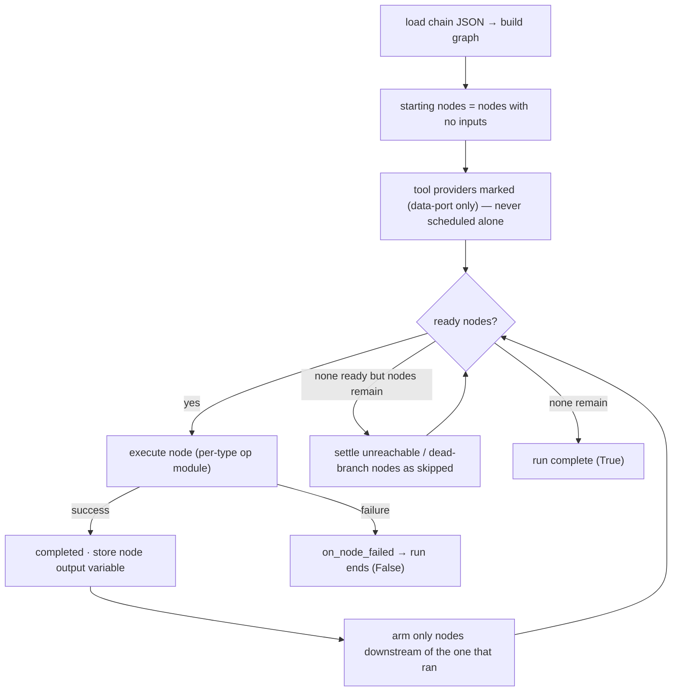

| Rule | Behavior |
|------|----------|
| **Readiness** | A node runs when every **execution-port** input is completed *and* it is reachable from the node that just ran (a cumulative completed-set scan alone would re-arm stale nodes) |
| **Data edges never gate** | `context`, `tools`, `args`-style connections are read at execution time; they order nothing |
| **Tool providers** | A node wired only to data ports (an LLM's `tools`, an orchestrator's `brains`/`chains`) is skipped as a standalone node — the router runs it as a subroutine (`[SKIP] Tool provider…` in the log) |
| **Branch skip** | A conditional's unchosen tree is BFS-marked skipped, minus nodes also reachable from the chosen port, so merges never stall |
| **Dead settlement** | Nodes that can never be armed again (left behind by the execution path, or on a dead branch) settle as skipped instead of stalling the run |
| **Failure** | Any node that raises **stops the whole workflow**: `on_node_failed(node_id, type, data)` fires (GUI highlights the node), the run returns `False` |
| **Typing deferral** | No new node starts while an LLM node is actively writing text — with a ~30 s spin guard against leaked `_writing` flags |
| **Loop re-entry** | After execution settles, a graph-loop condition gets one more iteration check before the run is declared complete |
| **Stop** | The stop flag (ESC / Stop button / phone stop) is checked at every scheduler tick and inside long actions; no timeouts are imposed on local inference |
| **Sandbox runs** | In sandbox mode every action is proxied to the RDP agent (§12); the scheduling rules above are unchanged |

### Node dispatch

| Node type | Executor | Outcome stored |
|-----------|----------|----------------|
| `sequence` / `web_sequence` | replay the action list `loop_count` times | result var, screenshots |
| `conditional` | evaluate → arm `true`/`false`; loop types iterate | `conditional_result` |
| `llm` | prompt assembly → provider → optional typing → tool subroutine | `node_<id>_output` |
| `chain_import` | sub-player run with the propagation packet | `node_<id>_last_chain_result` |
| `code` | sandboxed Python (AST deps, subprocess for persistent loops) | result variable |
| `context` | collect → push to SQLite → pull `max_history` | `node_<id>_context` |
| `input` | manual dialog / agent extraction / decision routing | value (+ `true`/`false`) |
| `handle` | VLM grounding → click/drag | action JSON |
| `mcp` | MCP tool call | tool result |
| `orchestrator` | goal loop (§10) | answer + trace |
| `output` / `tts` / `form_filler` / `container` | display / speak / fill / group | — |

---

## 6. Data Flow Between Nodes

Two kinds of connection share one canvas:

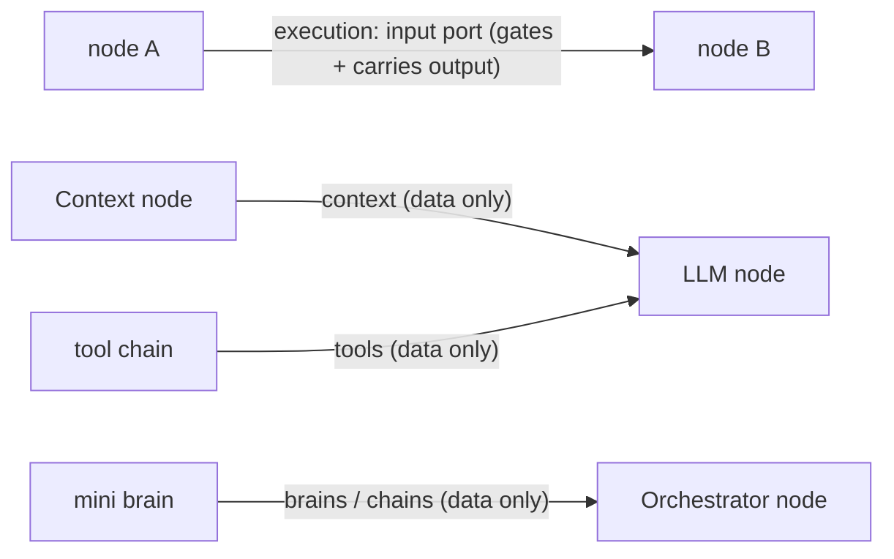

- **Execution edges** (the default `input` port) gate the run — they decide *when* a node runs, and the downstream node reads the upstream output when it executes.
- **Data edges** (`context`, `tools`, `args`, `context_in`, `brains`, `chains`) never gate — the consumer reads the values when it runs.

### Variable store

Every result lives in the `PortScopedStore` under node-scoped names, so ports cannot overwrite each other:

| Variable | Written by | Consumed by |
|----------|------------|-------------|
| `node_<id>_output` (or custom `output_variable`) | every node | `{variable}` substitution, `previous` input source |
| `node_<id>_context` | context / LLM nodes | `context`-port consumers |
| `node_<id>_last_chain_result`, `chain_tool_results` | chain import | router, orchestrator trace |
| `_chain_goal`, `_chain_step` | agent dispatch | prompt substitution inside the worker run |
| `_chain_root_goal`, `_chain_plan`, `_chain_state` | orchestrator activation | imported chains — propagation packet (§10.6) |
| `_chain_input_context` | orchestrator dispatch | imported chains |
| `node_<id>_blocked` | orchestrator (parked goal) | `route` port |

### Reads and substitution

| Consumer | Reads |
|----------|-------|
| LLM `input_source: previous` | `node_<id>_output` of the `input`-port predecessors |
| LLM `input_source: context` | `node_<id>_context` of the `context`-port predecessors |
| LLM `input_source: input` | values of connected Input nodes |
| Code node | `input_data` (scalar for one input, list for many), `args` dict from the `args` port |
| Prompts / text fields | `{variable}` placeholders resolved at execution; unknown names stay literal |

---

## 7. Conditional Logic

Property table and per-type truth semantics live in §4.3 — this section covers the branching and loop mechanics.

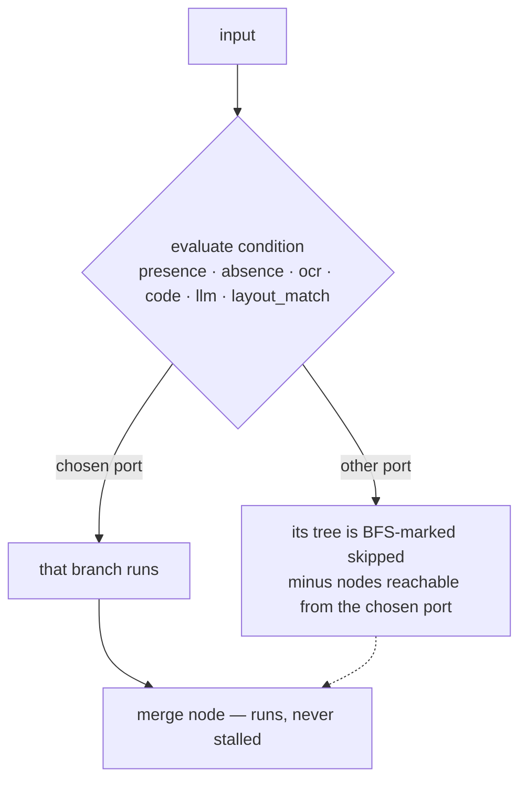

- The chosen port's connection defines the path; no connection there ends the chain.
- A node reachable from both ports (a merge) is never skipped.

### Loops

Looping is authored **on the conditional itself** — two shapes:

| Shape | Config | Behavior |
|-------|--------|----------|
| **File loop** | `loop_type` + `sequence_file` (or `chain_file`) | Replays the body until the condition releases it, then continues through a **single `output` port** (no `true`/`false` branching) |
| **Graph loop** | `loop_type` + true/false connections | Loops the graph branch; when the workflow settles, the loop re-arms its targets while the condition still holds |

| `loop_type` | Body repeats… |
|-------------|---------------|
| `while_present` | while the condition is true |
| `while_absent` | while the condition is false |
| `until_present` | until the condition becomes true |
| `until_absent` | until the condition becomes false |

Pacing with `iteration_delay` (default 0.05 s), optional `max_loops` guard, condition timeout via `wait_time`/`timeout`. Typical uses: wait-for-target with scroll, retry until a dialog closes, drain a list while rows remain.

---

## 8. LLM Integration

**Backends** — both served through the FastAPI layer (port 8000), which routes per request:

| Backend | Config | Notes |
|---------|--------|-------|
| Ollama (`:11434`) | `model: "llama3.2"` | Simplest; model pulled to Ollama's store |
| llama.cpp (`llama-server :8081`) | `use_llamacpp: true` + `llamacpp_model_path` (GGUF), `llamacpp_gpu_layers`, `llamacpp_threads`, `llamacpp_context_size` | Bundled runtime; vision through `llama-mtmd-cli` with an mmproj file |

**Input sources** (`input_source`):

| Source | Reads |
|--------|-------|
| `none` | Prompt only |
| `ocr` | Screenshot → OCR (confidence / region configurable) |
| `page_text` | Visible text of the chain's shared browser — shadow roots and same-origin iframes included |
| `previous` | Upstream `node_<id>_output` |
| `clipboard` | Clipboard text |
| `input` | Values of connected Input nodes |
| `context` | Entries of connected Context nodes |

**Prompt assembly**: system message → input-source text → prompt with `{variable}` substitution; tool descriptions are appended when a `tools` port is wired.

**Tool selection** — the model answers with exactly one line, `USE_TOOL:<id>`:

- Tool ids come from the runtime-derived descriptions of chain imports, MCP tools and code utilities wired to the `tools` port — name-based, never regex-parsed prose.
- `USE_TOOL:<id>{"arg": "value"}` passes inline JSON args for MCP / code tools; chain tools take no args. `CALL_TOOL:` / `TOOL:` prefixes are tolerated.
- Retrieval ladder: an embedding retriever narrows candidates with a threshold staircase (cosine similarity, floor + margin); a miss falls back to the plain prompt with no tool called.
- The selected tool executes as a subroutine — its own run, its result returned into the conversation.

**Skills**: `use_skill_routing` + `skills` list → the request is routed to one declared skill (embedding-similarity match via the embedding server), which supplies its specialized instructions for that generation.

**Vision**: `use_vision: true` + `vision_model` — a screenshot (`screenshot_enabled`) is sent to the VL model; grounding-heavy steps can use the recursive vision reasoner. For click-grounding without selectors, prefer the Handle node (§4.10).

**Direct RAG**: `use_direct_rag` + `rag_*` — retrieval against context / document sources before generation.

**Consolidation**: `use_context_consolidation` — a probe-driven loop that reorganizes the context store (ComoRAG probes over stored entries); configured through the `consolidation_*` properties.

**Output**: response stored under `output_variable` (default `llm_output`); `write_text` types it at the cursor. When the output connects to a TTS node, auto-typing is disabled and the TTS node speaks the value (§4.5).

---

## 9. Context System

The Context node's store is an append-only SQLite database (`data/context.db`) shared across runs; nodes push entries into it, LLMs consume them, and consolidation reorganizes them.

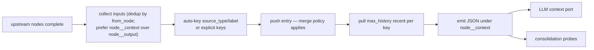

### Scopes

| Scope | Lifetime | Use for |
|-------|----------|---------|
| `run` | Cleared at each chain run start | Scratch memory inside one run |
| `chain` (default persistent) | Survives runs | The chain's evolving memory |
| `global` | Shared across all chains | Long-lived knowledge |
| shared chain file | Two chains point `shared_context_chain_file` at the same store | Pipelines / central knowledge base |

### Merge and retention

| Setting | Effect |
|---------|--------|
| `default_merge_policy` | `append` (keep history), `replace` (latest wins), `merge_dict` (dict keys merged) |
| `key_policies` | Per-key override of the merge policy |
| `max_entries_per_key` | Retention cap per key (0 = unlimited) |
| `max_history` | How many recent entries the node pulls per run |

### Formats and extras

- `output_format: structured` emits JSON; `narrative` emits prose ready for prompts.
- `auto_capture_responses` stores upstream LLM query/response pairs under the `history` key.
- `agent_visible: true` lets agent-mode answers quote the entries.
- Cross-chain sharing: both chains read **and write** the same entries — Chain A stores, Chain B (same `shared_context_chain_file`) decides.

---

## 10. Agent Mode

### 10.1 System chains & dispatch

- A **System chain** is the agent's mind: every agent-mode query executes through the selected System chain (chip selector), via `SimpleChainRouter.handle_request` → `ChainExecutor` → `MultiSequencePlayer` — the exact manual-playback path, so every agent run lands in the activity timeline.
- The `is_default` chain is the root (`chains/ORCHESTRATOR.json`): an Orchestrator node (`picker: laya`, `max_steps: 15`, `use_goal_ledger`) with mini brains wired to `brains` and deterministic chains to `chains`.
- A memory-only request ("what did you do today?") is answered from the run-memory timeline without executing any chain.

### 10.2 The goal loop

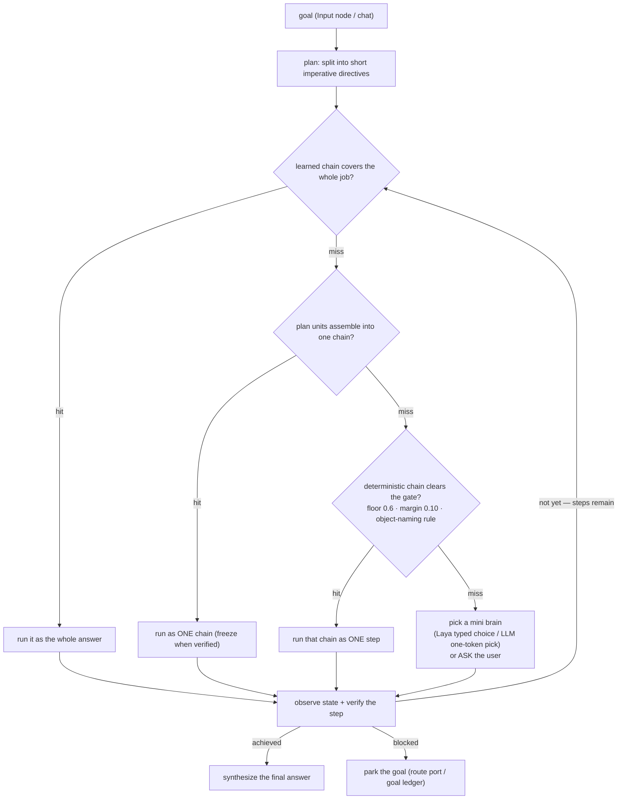

- `max_steps` bounds one activation; `picker: laya` means **no output parsing anywhere** in the loop (typed questions only); `picker: llm` uses strict one-token picks (worker number / DONE / ASK).
- The **world-state digest** — read-only observation of the chain's live web page and the desktop foreground window — rides into the chains gate, the picker, the scoper and the verifier, so judgments use what the world shows, not only the brain's prose (`LOOPER_ORCH_STATE=off` disables it).
- A run that does not achieve the goal publishes the unfulfilled goal on the `route` port for a sibling orchestrator; a parked goal sets `blocked` and (with `use_goal_ledger`) resumes on the next scheduled wake.

### 10.3 Worker kinds — the wiring rule

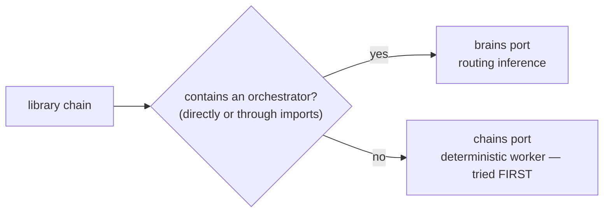

One rule classifies every chain worker; nothing is hand-tagged. Workers are only ever chosen among what is wired — the schema is the menu.

### 10.4 Deterministic chains & freeze

- When a run ends **naturally** with every step verified, the orchestrator compiles it into a learned chain: `.pending_` → `learned_…` (atomic write + `.bak`), auto-wired into the ladder — next time it is rung one.
- ALL gates required: `stop_reason == 'done'` (never after ESC/stop), every step verified true, every executed step was an orchestrator-free library chain re-validated on disk. `LOOPER_LEARN=off` disables freezing.

### 10.5 Worker naming rules

Descriptions the routers see are **derived at runtime** from the worker's own composition, so hand-written prose can never go stale. The deterministic namer turns a step into its matching vocabulary:

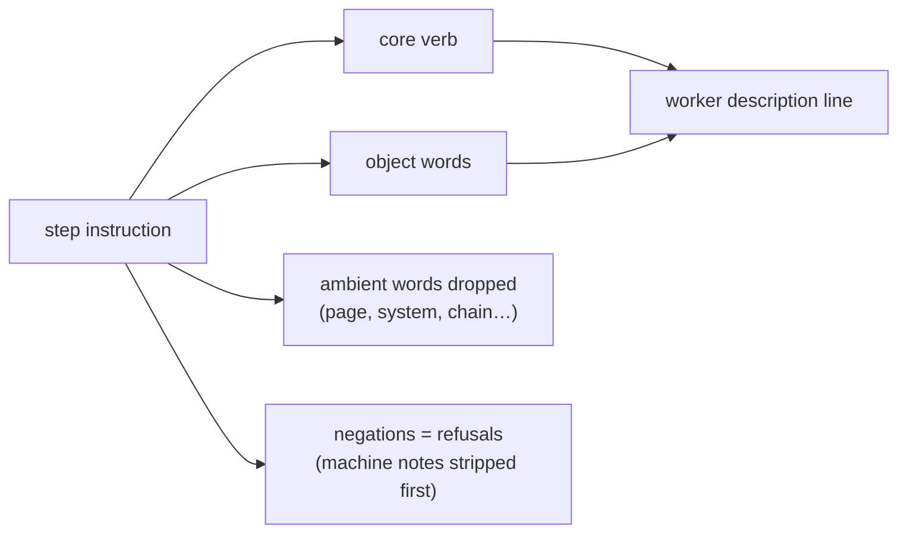

- The chains gate adds the **object-naming rule**: a candidate that never names the step's object cannot win that step.
- Machine notes (`[inputs: …]`, `[tools: …]`) are stripped before refusal detection — a `screen_check` tool hint is not a refusal.

### 10.6 Propagation packet

Carried across every chain boundary (copied into each imported chain):

| Variable | Meaning |
|----------|---------|
| `_chain_goal` | the assigned step (when relayed: the original goal) |
| `_chain_step` | human label of the current step |
| `_chain_root_goal` | the original user goal — published per activation, inherited only when relayed |
| `_chain_plan` | JSON `{index, total, remaining}` of the parent's plan |
| `_chain_state` | world-state digest at dispatch |
| `_chain_input_context` | input companion data |

Consumption points:

- Prompt compose adds `Root goal: …` when it differs from the local goal.
- The planner adds `PARENT PLAN: i/n done; remaining: …` so a nested orchestrator never re-plans finished work.
- A nested blind run falls back to `Parent-observed: …` instead of nothing.
- Handback: the worker's answer carries `[ORCH-REMAINING]` (what is still open) and `[ORCH-OUTCOME]` (`{stop_reason, steps, observed}`); the orchestrator strips the markers from the prose and files them in the trace.

### 10.7 Run memory

- Append-only SQLite timeline (`data/run_memory.db`): every run, node, chat turn and schedule event (`begin_run` / `record_node` / `end_run`), scoped `agent` / `manual` / `schedule`.
- Powers the activity panel, memory-only chat answers and agent retrospectives.
- `LOOPER_RUN_MEMORY=off` disables recording; `LOOPER_RUN_MEMORY_DB` overrides the database path.

### 10.8 Laya (optional decision engine)

- Role: System-1 decisions — the orchestrator `picker` (typed `noul`/`choice` questions → zero parsing), chain-gate scoring, step verifiers, web-element picks inside Handle.
- Runs as a burst daemon: loads (~2 s) per decision burst, unloads after `LOOPER_LAYA_KEEP_ALIVE_SECONDS` (default 2.0); no timeouts.
- Fallback: every consumer degrades to the LLM path when Laya is off or unavailable.
- Switches: `LOOPER_LAYA=0/off/disabled` (kill; legacy alias `LOOPER_JEV`), `LOOPER_LAYA_MODEL` (GGUF override), `LOOPER_LAYA_EXE` (binary override), `LOOPER_LAYA_THREADS`.

### 10.9 Routing shadows

Two INFO-only diagnostics per activation; they never route anything:

| Shadow | What it logs |
|--------|--------------|
| **Action graph** | The action entities derived from what the executor actually reads (web/sequence targets, labels, handle goals) + executor-thread edges + collapsed imports — the routing substrate and its coverage |
| **Plan projection** | Each plan directive projected onto the workers' candidate lines: `directive -> worker: line (shared: …)` or `UNMATCHED`, ending with `(projection: k/n …)` |

Purpose: funnel losses become a number (plan wording no wired action can serve) instead of a post-mortem replay. `LOOPER_ORCH_GRAPH=off` silences both.

### 10.10 Debugging agent mode

Log markers in `logs/run.log`:

| Marker | Meaning |
|--------|---------|
| `[ORCH] Node … start: goal=… brains=… chains=… picker=…` | Activation begins |
| `[ORCH] Node …: goal split into N directive(s)` | Plan built |
| `[ORCH] Node …: <worker> serves N` | Worker chosen / scope |
| `[ORCH] Node …: directive k/n verified` | Step verification |
| `[ORCH] Node … step k observed state: …` | World digest at that step |
| `[ORCH] … plan complete` / `[ORCH] … stopped by user` | Termination |
| `[ORCH-REMAINING]` / `[ORCH-OUTCOME]` | Worker handback (parsed from the answer) |
| `[SKIP] Tool provider …` | Node wired only as a router subroutine |
| `Action graph (shadow)` / `(projection: k/n)` | Routing diagnostics |

Kill switches recap: `LOOPER_ORCH_GRAPH=off` (shadows), `LOOPER_ORCH_STATE=off` (world digest), `LOOPER_LEARN=off` (freeze), `LOOPER_LAYA=off` (decision engine).

### 10.11 Input & Handle behavior in agent mode

- Input nodes: manual → dialog; agent + `agent_modifiable` → **one extraction turn** grounded in the goal and observed state (grounded-or-ask — never invents a value); decision modes judge a criterion into `true`/`false`; question modes route answers; `passthrough` stores without typing.
- Handle nodes: `agent_adaptive` asks the user for a missing goal description; `web_mode` resolves the goal against the chain's live page and clicks via the web ladder (native input → JS dispatch).
- Questions reach the user on the desktop app or the phone/remote UI the run was started from; its Stop aborts like ESC.

---

## 11. Scheduling

The SchedulerService runs chains on a timetable **in-process**, via the same MultiSequencePlayer path as manual playback — so sandbox bridges, stop handling and threading behave identically in source and compiled builds.

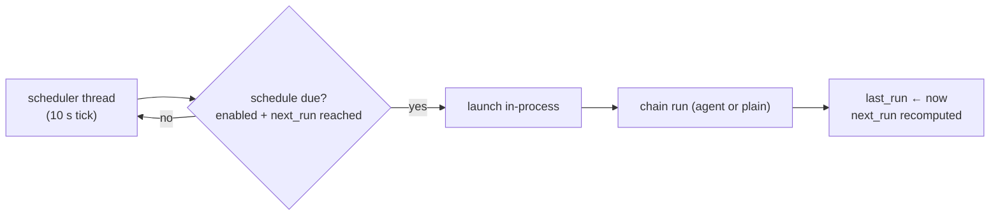

### Schedule types

| Type | Fires |
|------|-------|
| `once` | A single time |
| `daily` | Every day at a fixed time |
| `weekly` | On chosen weekday(s) |
| `interval` | Every N minutes/hours |

### Managing schedules

- The Scheduler dialog lists schedules with next/last run, an enable toggle and **Run now**; edits persist to `schedules.json` (project root).
- Stored fields: `id`, `chain_path`, `type`, `enabled`, `last_run`, `next_run` (+ type-specific timing).
- Manual and phone-started runs share the same launcher (`run_chain_now`) — the caller supplies its own question callback and stop flag.
- A blocked agent goal (`use_goal_ledger`) resumes on the next scheduled wake of the chain that owns it.

---

## 12. Sandboxing

Sandboxing runs a chain on an **isolated RDP desktop**: the chain executes normally, but every physical action is relayed to an agent process living inside that session — your own desktop is never touched.

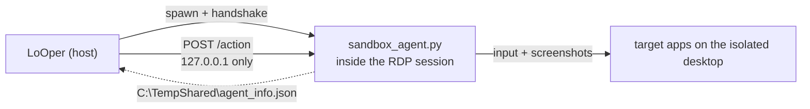

### Enabling

- Chain Import node → `run_in_sandbox: true`; `show_sandbox_window` decides whether the session is visible or hidden.
- Sandbox context propagates to every imported chain, so nested runs stay in the same session.

### Agent HTTP API (`POST /action`)

| `action` | Payload | Performs |
|----------|---------|----------|
| `click` | `x`, `y`, `button`, `modifiers`, `points[]` | Move (optionally along points) + click |
| `type` | `text`, `interval` | Character typing |
| `clipboard_paste` | `text` | Clipboard + Ctrl+V (Unicode-safe) |
| `hotkey` | `keys[]` | Key chord — modifiers never left stuck |
| `key_down` / `key_up` / `release_all_keys` | `key` | Held-key control |
| `get_position` | — | Cursor + screen size |
| `screenshot` | — | Base64 PNG + id/timestamp/size |
| `move` / `scroll` | coords / `amount` | Cursor movement / wheel |
| `drag_start` / `drag_end` / `drag_drop` | coords | Mouse drag |
| `exec_code` | `code`, `timeout`, `input_data`, `args`, `output_variable` | Runs Python inside the session, returns the result |

Transport notes: the agent binds **loopback only** (a LAN host cannot inject input); the port comes from `LOOPER_AGENT_PORT` / `--port` (default 8000); the handshake file `C:\TempShared\agent_info.json` tells the host where to connect. Client side lives in `sequence_executor.py` / `node_executor.py`.

### Direct vs sandbox

| Aspect | Direct | Sandbox |
|--------|--------|---------|
| Where it runs | In-process, your desktop | Agent process in the RDP session |
| Input injection | Local pyautogui | HTTP → agent pyautogui |
| Screenshots | Local capture | Base64 over HTTP |
| Desktop impact | You watch it | Isolated session |
| Visibility | Always | `show_sandbox_window` toggles |

Helpers: `setup_rdp_agent.py` (session setup), `test_rdp_clicks.py` (smoke test), `LoOper/tests/test_sandbox_and_builder.py` (unit tests).

---

## 13. Practical Workflow Patterns

### Pattern 1 — Linear chain

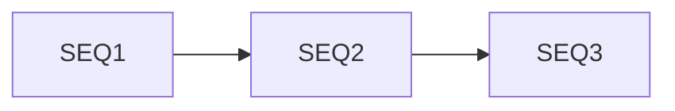

Fixed step-by-step flows: SEQ1 has no inputs and starts; each next node arms when the previous completes.

### Pattern 2 — Conditional with verification merge

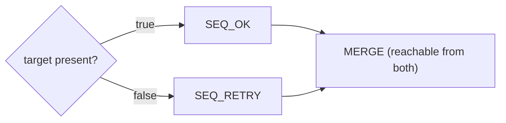

The merge is never skipped — it is reachable from the chosen port.

### Pattern 3 — Retry / wait loop

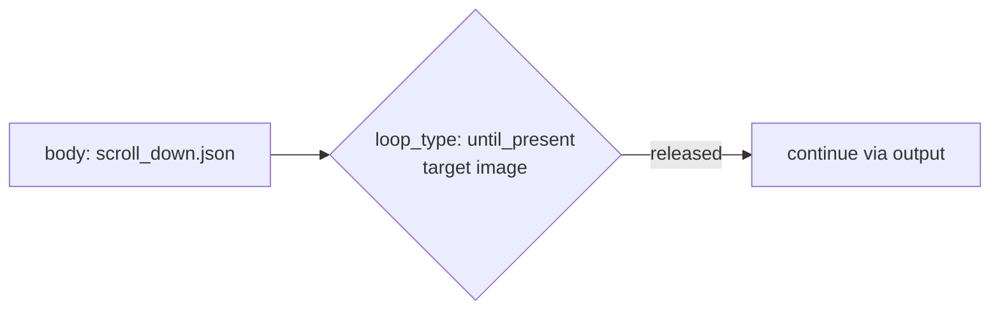

The body replays until the condition releases it; `iteration_delay` paces the loop.

### Pattern 4 — Data pipeline (Input → Code → Context → LLM)

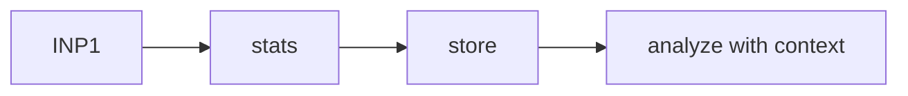

Input feeds the code node, the result is stored by the context node, and the LLM consumes it through the context port.

### Pattern 5 — Cross-chain shared context

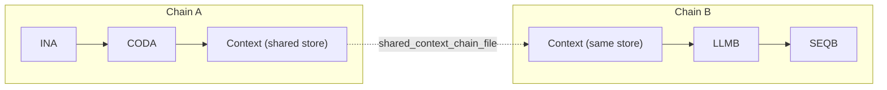

Chain A stores; Chain B decides with what Chain A stored.

### Pattern 6 — LLM tool selection

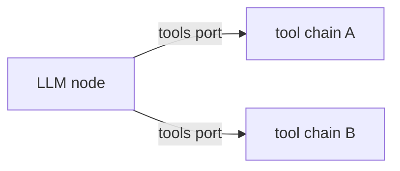

Tools are offered by runtime description and invoked by `USE_TOOL:<id>`; a chain wired only to `tools` never runs standalone (§5).

### Pattern 7 — Agent goal loop

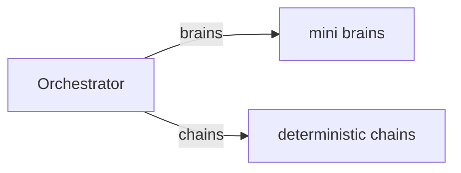

The full loop, worker rules and diagnostics are §10; this is the wiring shape.

---

## 14. Node Dialogs Reference

Quick map of what each node dialog exposes (property semantics are §4).

| Dialog | Key controls |
|--------|--------------|
| **Sequence** | Sequence file picker; loop count; extra delay; focus app before playing; description |
| **Web Sequence** | Session file picker (`web_sequences/`); headless toggle; speed; native actions; loop/repeat mode; extract items |
| **Conditional** | Condition type; **Capture…** trigger; threshold; wait/timeout; OCR text + case/language; code editor; LLM options; loop type/position/body/max |
| **LLM** | Backend (Ollama vs llama.cpp), model / GGUF path, GPU layers/threads/context; prompt + system message; temperature/max tokens; output variable; input source; vision; skills; consolidation |
| **Chain Import** | Chain file picker; import mode; prefix; loop/delay; run in sandbox + show sandbox window |
| **Code** | Inline editor or file path; description; timeout; output variable |
| **Context** | Label; max history; persistent; scope; keys + per-key policies; merge policy; retention; auto-capture; format; shared chain file; agent-visible |
| **Input** | Label; user prompt; default; passthrough; agent-modifiable; decision mode (+criterion/evaluator/default); question mode (+choices/route); media acceptance |
| **Handle** | Action type; goal description; drag target; agent-adaptive; web mode |
| **MCP** | Server transport/command; discovered tools list |
| **Output** | Display target: chat bubble / popup / variable name |
| **Orchestrator** | Description; max steps; picker; engine/model; synthesize (+system message); goal ledger |
| **Form Filler** | Document/knowledge sources; field rails; validation + repair; review gate |
| **TTS** | Text; language |
| **Container** | VM grouping (sub-graph containers deprecated) |

---

## 15. Keyboard Shortcuts

### Graph editor

| Shortcut | Action |
|----------|--------|
| Ctrl+C / Ctrl+V | Copy / paste selected node(s) |
| Delete | Delete selected node(s) |
| ESC | Close dialogs and overlays |

### Recording gestures (hold while clicking)

| Gesture | Records |
|---------|---------|
| ESC | Stop recording |
| Right-Shift + Left click | `absolute_click` (no offsets) |
| Ctrl + Left click | `ctrl_click` |
| Shift + Left click | `shift_click` |
| Right-Ctrl + move mouse | `move_to` — cursor movement only |
| Insert + click/drag, then a sibling | Repeating-element mark: the pair defines the set for element-driven replay |

---

## 16. Troubleshooting

| Symptom | Likely cause | Fix |
|---------|--------------|-----|
| "No starting nodes found" | Every node has an input edge (cycle) | Add a true entry node; check loop-back wiring |
| Chain import never runs | Wired only to a router port (`tools`/`brains`/`chains`) | Expected — it runs as a subroutine; wire the `input` port for standalone runs |
| Workflow stalls / STALL-DEADEND | Nodes left unreachable by the taken path | The engine settles them as skipped; if it persists, check conditional branch wiring |
| Click lands on the wrong spot | Layout / DPI / theme drift | UIA element replay is tried first — re-record with a fresh screenshot, or use Layout Match for position-aware targets |
| LLM returns empty | Backend down or context overflow | Check Ollama / llama-server in the log; shrink the context; verify the model path |
| Orchestrator picks the wrong worker | Plan wording vs worker descriptions | Read `Action graph (shadow)` + `(projection: k/n)` in the log; wire the worker or align the step's object naming |
| Orchestrator asks too early | No candidate clears the gate | Wire the capable chain to `chains`/`brains`; make the worker's composition name the step's object |
| Worker's result ignored | Handback markers missing from its answer | Chains run through the orchestrator add `[ORCH-REMAINING]`/`[ORCH-OUTCOME]` automatically; keep custom outputs compliant |
| Goal parked | Budget spent without achieving | Enable `use_goal_ledger` to resume on the next scheduled wake; check the `route` port |
| No learned chain appears | Freeze gates unmet | Requires natural completion + all steps verified + orchestrator-free steps; check `LOOPER_LEARN` |
| Laya never used | Disabled or binary/model missing | Inspect `LOOPER_LAYA*` switches — every consumer falls back to the LLM automatically |
| Sandbox run does nothing | Agent not reachable | Check `C:\TempShared\agent_info.json`, the agent process/log, and the port (`LOOPER_AGENT_PORT`) |
| Unicode typing garbled | Keyboard layout | Use the clipboard path (`clipboard_paste`) — it is layout-independent |
| Code node times out | Long or GUI-loop computation | GUI + `while True` is auto-detected and runs as a subprocess; raise `timeout` if needed |
| Context always empty | `scope: run` clears each run | Use `chain`/`global` scope for persistence |
| Agent only recalls the timeline | Request matched run memory | Expected: memory-only questions never execute chains |

---

## Appendix A — File Formats

### Sequence file (desktop)

```json
{
  "metadata": {
    "created_at": "2026-09-24 14:39:49",
    "total_actions": 3,
    "duration_sec": 12.4,
    "mode": "desktop_only"
  },
  "actions": [
    {
      "type": "click",
      "button": "left",
      "coordinates": {"x": 820, "y": 430},
      "screenshot": "screenshots/ab12cd.png",
      "screenshot_hash": "…",
      "app_context": {"process_name": "chrome.exe", "title": "…"}
    },
    {"type": "type_string", "text": "hello", "batch_size": 20, "batch_delay": 0.01},
    {"type": "keystroke", "key": "enter", "modifiers": []}
  ],
  "images": {"<md5>": "<base64>"}
}
```

Screenshots are content-deduplicated: `images` maps an MD5 to one base64 blob, and each action references it by `screenshot_hash`.

### Web sequence file

```json
{
  "schema_version": 1,
  "mode": "web",
  "metadata": {
    "created_at": "2026-09-23 19:13:29",
    "total_actions": 1,
    "duration_sec": 8.3,
    "mode": "web",
    "start_url": "https://www.linkedin.com/mynetwork/grow/",
    "name": "jobs"
  },
  "actions": [
    {
      "type": "click",
      "ts": 1790212412261.0,
      "locator": {
        "tag": "a",
        "text": "Jobs",
        "href": "https://www.linkedin.com/jobs/",
        "aria_label": "Jobs, 0 new notifications",
        "text_xpath": "//a[normalize-space(.)=\"Jobs\"]",
        "css": "…",
        "viewport": {"x": 750, "y": 0, "w": 80, "h": 52}
      },
      "frame_path": [],
      "cross_origin_frame": false,
      "coordinates": {"x": 765, "y": 37},
      "button": "0",
      "modifiers": [],
      "url": "https://www.linkedin.com/mynetwork/grow/",
      "title": "Grow | LinkedIn",
      "entity": null
    }
  ]
}
```

Replay is **element-driven**: `locator` identity first (text / aria-label / href / XPaths / CSS), never the stored `coordinates`.

### Chain file

Format and a minimal example are §3 (top-level node sections + per-node `connections`).

---

## Appendix B — Environment Switches

| Variable | Effect |
|----------|--------|
| `LOOPER_ORCH_GRAPH=off` | Silence the action-graph + plan-projection shadows |
| `LOOPER_ORCH_STATE=off` | Disable the orchestrator's world-state digest |
| `LOOPER_LEARN=off` | Disable learned-chain freezing |
| `LOOPER_LAYA=0/off/disabled` | Kill the Laya decision engine (LLM fallback; legacy alias `LOOPER_JEV`) |
| `LOOPER_LAYA_MODEL` | Override the Laya GGUF (bare name resolves in `AI/models/laya-GGUF`) |
| `LOOPER_LAYA_EXE` | Override the `laya.exe` path |
| `LOOPER_LAYA_THREADS` | Laya thread count |
| `LOOPER_LAYA_KEEP_ALIVE_SECONDS` | Idle unload for the burst daemon (default 2.0) |
| `LOOPER_RUN_MEMORY=off` | Disable run-memory recording |
| `LOOPER_RUN_MEMORY_DB` | Override the `run_memory.db` path |
| `LOOPER_GOAL_LEDGER` | Override the goal-ledger storage path |
| `LOOPER_DESC_REPAIR` / `LOOPER_DESC_MODEL` / `LOOPER_DESC_FEEDBACK_LOG` | Description self-repair: toggle, model, feedback log path |
| `LOOPER_AGENT_PORT` | Sandbox agent port (default 8000) |
| `ARROW_DIRECT_ENGINE=1` | Launcher runs a script directly (exported agents / RDP sandbox) |
| `ARROW_LOGS_DIR` | Override the log directory |
| `ARROW_NO_COLOR`, `ARROW_CONSOLE_BLOCK_MAX`, `ARROW_MD_BLOCK_MAX`, `ARROW_RICH_BLOCK_MAX` | Console/log rendering controls |

---

## Appendix C — Testing & Evaluation

- **Unit suite**: `LoOper/tests/` — 80 modules, ~1900 tests. Run:

  ```powershell
  .venv\Scripts\python.exe -m pytest LoOper/tests -q
  ```

  For headless/CI runs set `QT_QPA_PLATFORM=offscreen`. Focused suites for agent-mode work: `test_orchestrator_node.py` (goal loop, picker, propagation packet, shadows) and `test_action_graph.py` (routing substrate + resolver regression).

- **Evaluation plan**: `docs/EVALUATION_PLAN.md` — a golden-request corpus with known-good outcomes, a four-stage ladder (0a routing-only → 0b planner-only → 1 dry-run → 2 live end-to-end), and the metrics that matter: first-hop accuracy, forbidden-hit gate (must stay 0), projection coverage, outcome facts, honest-stop and waste. Benchmarks M1/M2/M3 and the A/B acceptance bar are defined there.

- **Baselines recorded so far**: the incident plan projected 1/3 directives onto wired workers (plan wording vs available actions — the funnel the shadows measure), and the targeted agent-mode suites were green at 156 + 28 tests.

---

*Documentation version 3.0 — consolidated single-source guide (all flows Mermaid, tables derived from the source). Supersedes the previous multi-document revisions.*
